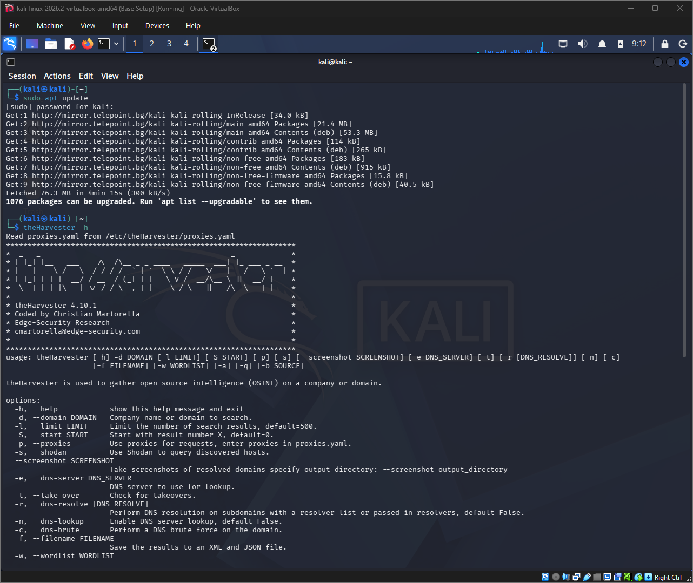
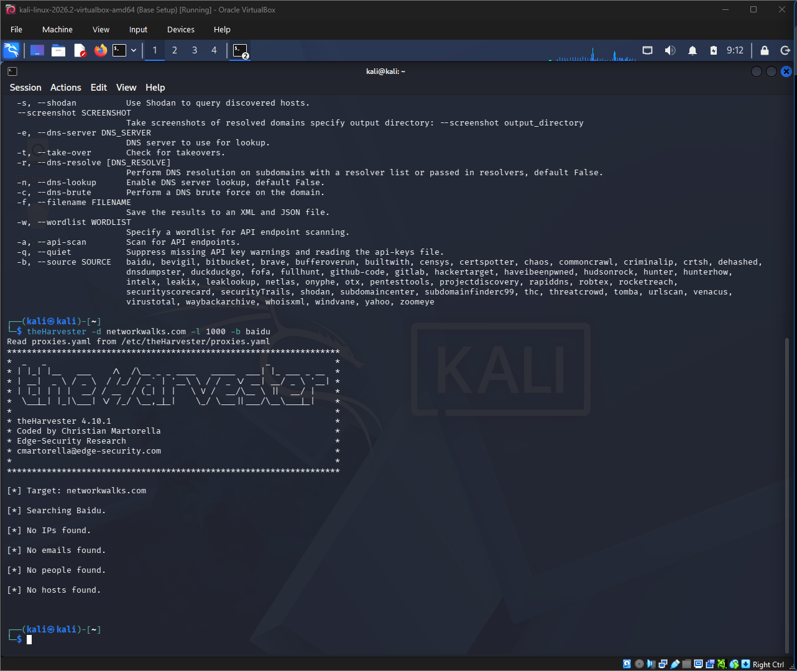
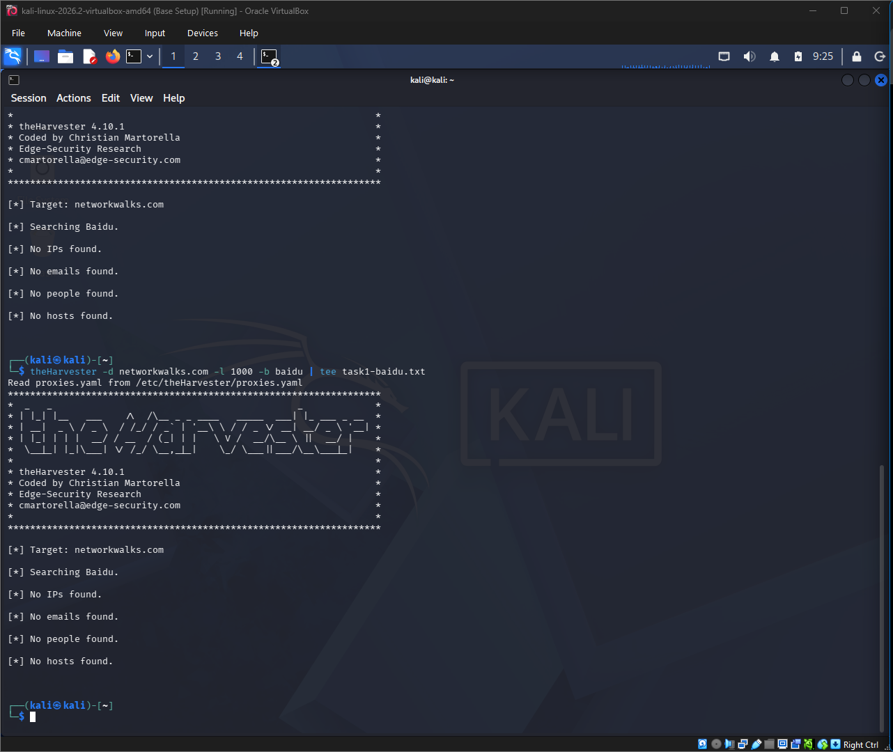
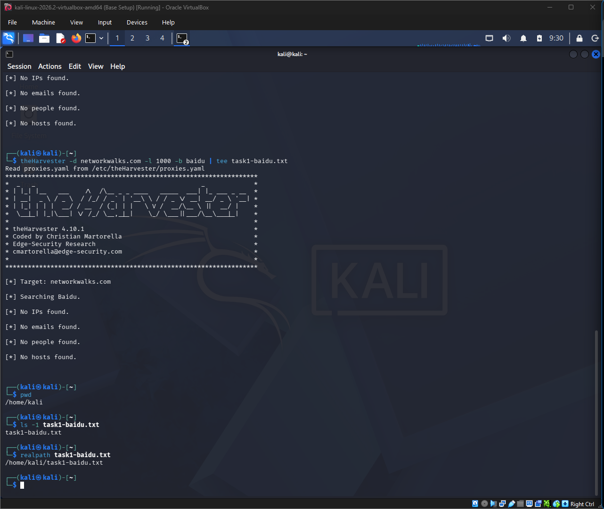
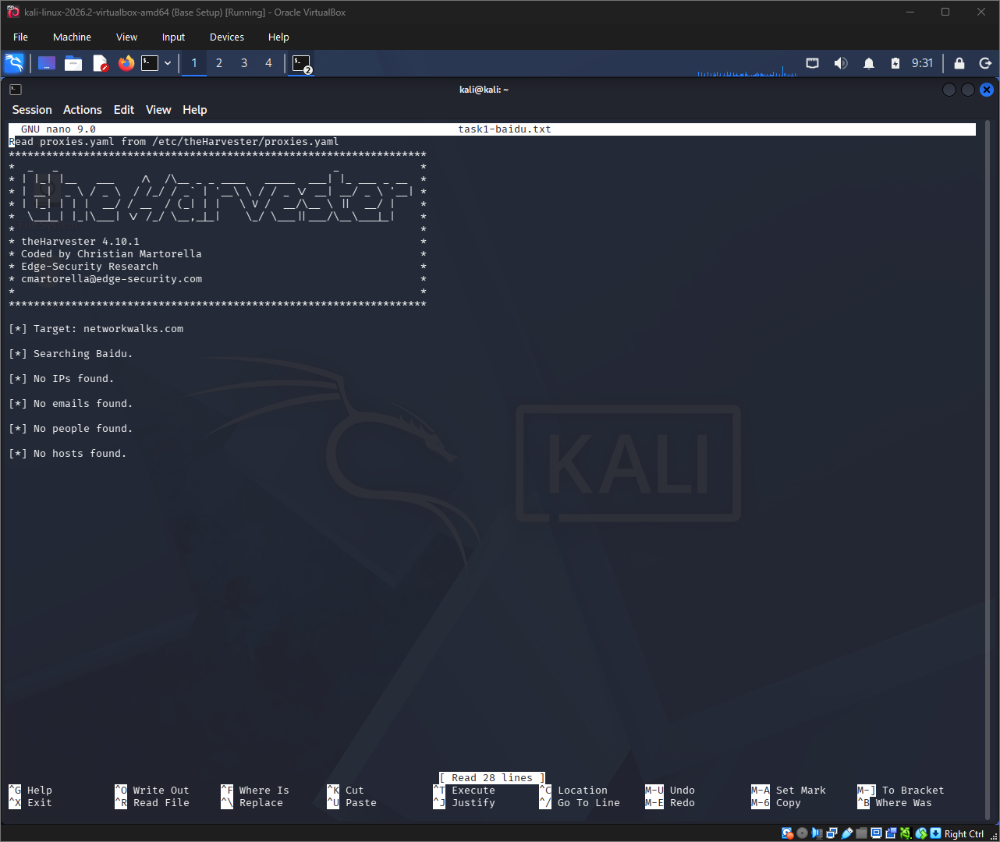
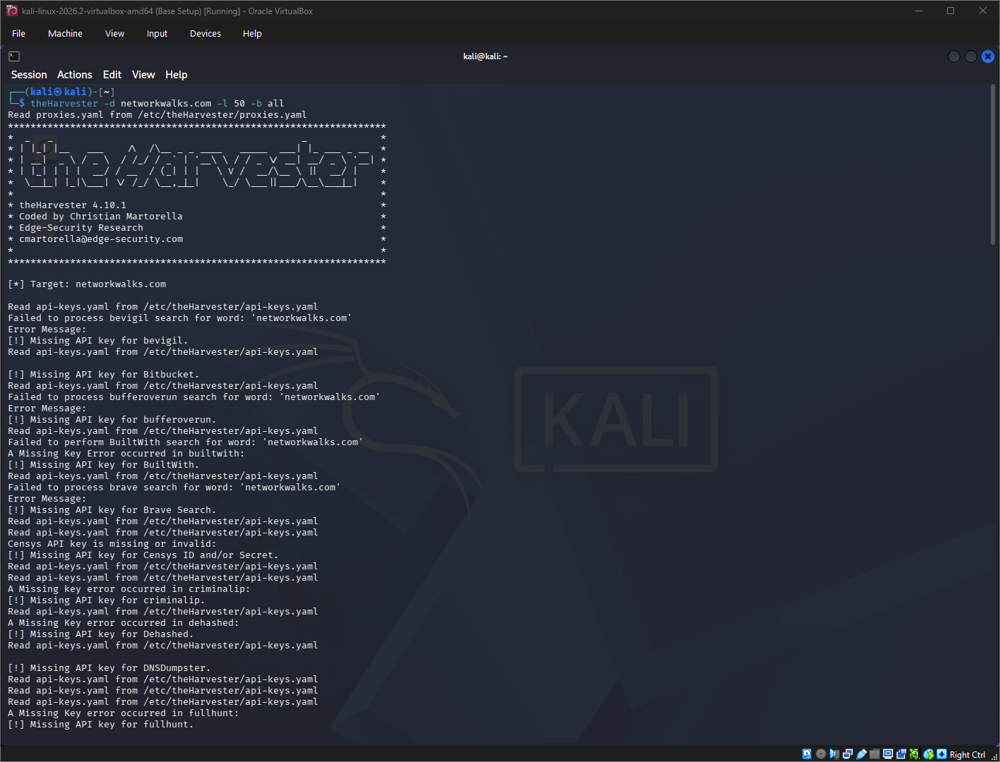
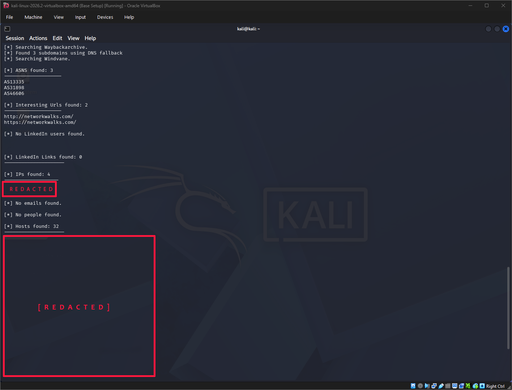
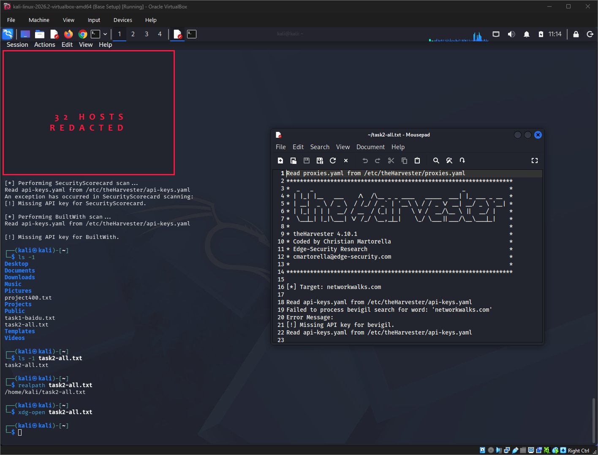
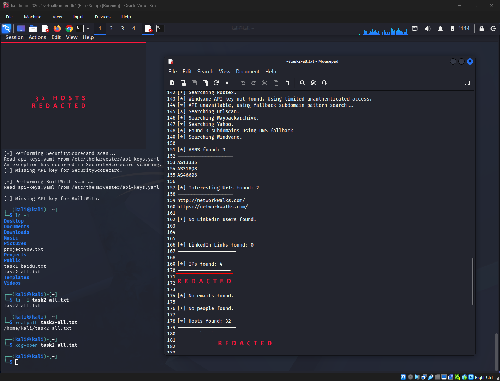

# Week 2 Project Module 4: Footprinting with theHarvester

Cybersecurity Internship Programme — **NETWORKWALKS Batch B082**

This project documents passive footprinting and Open-Source Intelligence (OSINT) reconnaissance using **theHarvester** on Kali Linux.

The objective was to gather publicly available information associated with the authorised target domain using different data sources, save the results as evidence, and document the process.

## Environment

- Kali Linux 2026.2
- theHarvester 4.10.1
- Oracle VirtualBox
- Target: `networkwalks.com`

## theHarvester Usage

Before beginning the reconnaissance tasks, I reviewed theHarvester's available options using:

```bash
theHarvester -h
```



The help output confirmed the available parameters and supported data sources, including:

- `-d` — target domain
- `-l` — result limit
- `-b` — data source

---

## Task 1: Footprinting with Baidu

The first task used **Baidu** as the source with a result limit of 1000.

```bash
theHarvester -d networkwalks.com -l 1000 -b baidu
```



The command completed successfully, but Baidu returned:

- No IP addresses
- No email addresses
- No people
- No hosts

A search returning no findings does not necessarily indicate a failed command. Results depend on what information the selected external source has indexed and makes available.

### Saving the Output

I repeated the command using `tee` so the output could remain visible in the terminal while also being written to a text file.

```bash
theHarvester -d networkwalks.com -l 1000 -b baidu | tee task1-baidu.txt
```



The saved file was then verified using:

```bash
pwd
ls -l task1-baidu.txt
realpath task1-baidu.txt
```



The file was opened using Nano to confirm that the output had been saved correctly.

```bash
nano task1-baidu.txt
```



The saved evidence is available in:

```text
evidence/task1-baidu.txt
```

---

## Task 2: Footprinting with Multiple Sources

The second task queried all supported theHarvester sources with a result limit of 50.

```bash
theHarvester -d networkwalks.com -l 50 -b all
```



Several of the supported sources require API credentials that were not configured in the local installation. theHarvester reported the unavailable sources and continued querying sources that were accessible.

The completed run returned:

- 3 ASNs
- 2 interesting URLs
- 4 IP results
- 32 host results
- No email addresses
- No people
- No LinkedIn users



The actual IP addresses and discovered hostnames have been intentionally redacted from the public evidence.

### Saving and Verifying the Output

The Task 2 output was saved as:

```text
task2-all.txt
```

The file was verified using:

```bash
ls -l task2-all.txt
realpath task2-all.txt
```



Rather than opening this file in Nano, I used:

```bash
xdg-open task2-all.txt
```

This opened the output using Kali's default graphical text editor.



For public documentation, a sanitised version of the output was created:

```text
evidence/task2-all-redacted.txt
```

The public version retains the result counts and general tool output while removing discovered IP addresses and host information.

---

## Linux Output Redirection

While saving the results, I also worked with several Linux output-redirection methods.

### `>`

```bash
command > file.txt
```

Writes command output to a file. Existing file contents are replaced.

### `>>`

```bash
command >> file.txt
```

Appends command output to an existing file.

### `tee`

```bash
command | tee file.txt
```

Displays the command output in the terminal while simultaneously writing a copy to a file.

For this project, `tee` was useful because I could observe theHarvester's output while creating an evidence file at the same time.

---

## Observations

- Different OSINT sources can return significantly different results for the same target.
- A reconnaissance source returning no findings does not necessarily indicate that the command failed.
- Some theHarvester sources require external API credentials.
- Using `-b all` attempts multiple sources, but not every source will necessarily be available.
- Accessible sources can still produce useful reconnaissance information when some API-backed sources are unavailable.
- Reconnaissance results may contain infrastructure information that should not automatically be published.

## What I Learned

This module provided practical experience with:

- Passive footprinting and OSINT reconnaissance
- theHarvester command syntax
- Querying individual and multiple OSINT sources
- API-dependent reconnaissance sources
- Saving terminal output as evidence
- Linux output redirection using `>`, `>>`, and `tee`
- File verification using `pwd`, `ls`, and `realpath`
- Opening files through both terminal and graphical tools
- Sanitising reconnaissance evidence before public disclosure

## Ethical Use and Scope

This project was completed for educational purposes as part of the **NETWORKWALKS Cybersecurity Internship Programme**.

The reconnaissance activity was performed against the internship-scoped target. Technical findings that could expose infrastructure details have been redacted from this public repository.

## Author

**Prince Manu Gyebi**  
Cybersecurity Intern — Batch B082  
**NETWORKWALKS**

LinkedIn: [Prince Manu Gyebi](https://www.linkedin.com/in/princemanugyebi)
